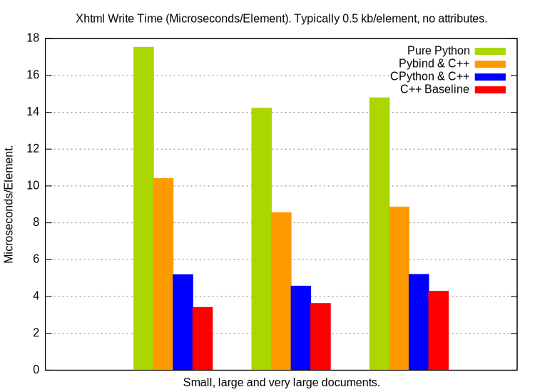
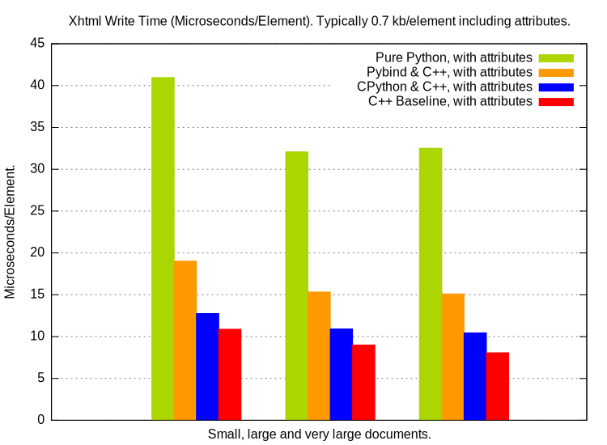
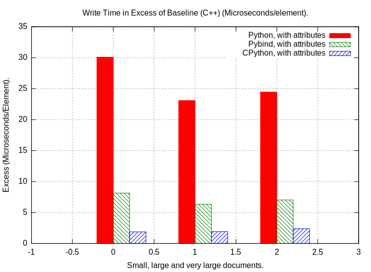

<a name="Introduction"></a>
# Introduction

This project takes a Python XML/HTML/SVG writer originally implemented in Python and migrates it to C++ with two popular interfaces, firstly [pybind11](https://github.com/pybind/pybind11) and secondly as a traditional C extension. The aim was to measure the performance of both interfaces and expose the trade offs between runtime performance and cost of development.

## What this Code Does

A XML writer makes it easy to generate well formed and correctly encoded XML and XHTML thus:

```
with XmlWrite.XhtmlStream() as xS:
    with XmlWrite.Element(xS, 'head'):
        with XmlWrite.Element(xS, 'title'):
            xS.characters('Virtual Library')
    with XmlWrite.Element(xS, 'body'):
        with XmlWrite.Element(xS, 'p'):
            xS.characters(u'Moved to ')
            with XmlWrite.Element(xS, 'a', {'href' : 'http://example.org/'}):
                xS.characters('example.org')
            xS.characters(' since >"2015".')
```

Then `xS.getvalue()` gives this:

```
<?xml version='1.0' encoding="utf-8"?>
<!DOCTYPE html PUBLIC "-//W3C//DTD XHTML 1.0 Strict//EN" "http://www.w3.org/TR/xhtml1/DTD/xhtml1-strict.dtd">
<html lang="en" xml:lang="en" xmlns="http://www.w3.org/1999/xhtml">
  <head>
    <title>Virtual Library</title>
  </head>
  <body>
    <p>Moved to <a href="http://example.org/">example.org</a> since &gt;&quot;2015&quot;.</p>
  </body>
</html>
```

The nature of this code is that many small objects are constructed that mostly have short lifetimes. If implemented in C/C++ then the cost of crossing the boundary from Python to C/C++ can be significant. For each element the Python interpreter makes at least five calls to a C/C++ implementation: `__new__`, `__init__`, `__enter__`, `__exit__`, `__del__`.


This project is based on the [pybind11 example](https://github.com/pybind/python_example).


<a name="Performance"></a>
# Performance

<a name="Performance_Selected_Benchmarks"></a>
## Selected Benchmarks

This measured the cost of creating XHTML of varying sizes. There are two tests for each size as the document is created with no attributes on each element, then with some attributes (see `BENCHMARK_ATTRIBUTES` in `tests/unit/_test_XmlWrite.py`). The value of the second test is that a far bigger payload must be transported and converted between Python and C/C++. We reduce the execution time to μs per element written with these size of documents:

* A "Small" document with 128 XML elements. About 61 kB without element attributes or 100 kB with attributes.
* A "Large" document with 2560 XML elements. About 1 MB without element attributes or 2 MB with attributes.
* A "Very large" document with 32768 XML elements. About 15 MB without element attributes or 24 MB with attributes.

The time to write each element in μs is shown below, first with no element attributes:



So pybind11 is about twice as fast a pure Python, C++ is twice as fast again and the CPython extension is around the C++ time plus 15 to 25% So CPython interface provides significantly less friction than the pybind11 one.

The story is similar when writing out attributes on each element where a much bigger payload has to be transferred from Python to C++:



Subtracting the execution time of the underlying C++ code gives the 'friction' caused by the pybind11 and C extension:



The C extension gives about 1/4 the friction of the pybnd11 one.

<a name="Performance_Summary"></a>
### Summary

* The pure C++ implementation is about four times faster than the pure Python one.
* pybind11 slows this C++ implementation down by a factor of two.
* The C extension slows this C++ implementation down by a factor of aroung 1.2.
* The 'friction' caused by the C extension is about 1/4 that of pybind11.


Of course these figures are only reflective of *this particular* problem.


<a name="History"></a>
# History (latest at top)

## 2018-04-24 - Adds a comparison with an equivalent C extension.

Wrote a C extension that uses the same C++ code as pybind11.

## 2018-02-26 - Python to C++ Documentation

Added automatic migration of python documentation strings with `pydoc2cppdoc.py`.

## 2017-12-05 11:45 - Made repository public

Made public around: Tue  5 Dec 2017 11:45:14 GMT

## 2017-12-05 11:44 - Last private commit

```
commit 517f5267709029fe9f651bf3e0b88655a40ae052
Author: Paul Ross <apaulross@gmail.com>
Date:   Tue Dec 5 11:44:17 2017 +0000
```
    Last private commit.


## 2017-11-27

```
commit f4267ff0eefe9a99c27a9b84ff22087e1ff29f1c
Author: paulross <apaulross@gmail.com>
Date:   Mon Nov 27 09:19:37 2017 +0000
```

    Initial commit.

<a name="Boilerplate_Footnotes"></a>
# Boilerplate Footnotes

## Installation

**On Unix (Linux, OS X)**

 - clone this repository
 - `pip install ./xmlwriter`

**On Windows (Requires Visual Studio 2015)**

 - For Python 3.5:
     - clone this repository
     - `pip install ./xmlwriter`
 - For earlier versions of Python, including Python 2.7:

   Pybind11 requires a C++11 compliant compiler (i.e. Visual Studio 2015 on
   Windows). Running a regular `pip install` command will detect the version
   of the compiler used to build Python and attempt to build the extension
   with it. We must force the use of Visual Studio 2015.

     - clone this repository
     - `"%VS140COMNTOOLS%\..\..\VC\vcvarsall.bat" x64`
     - `set DISTUTILS_USE_SDK=1`
     - `set MSSdk=1`
     - `pip install ./xmlwriter`

   Note that this requires the user building `xmlwriter` to have registry edition
   rights on the machine, to be able to run the `vcvarsall.bat` script.


## Windows runtime requirements

On Windows, the Visual C++ 2015 redistributable packages are a runtime
requirement for this project. It can be found [here](https://www.microsoft.com/en-us/download/details.aspx?id=48145).

If you use the Anaconda python distribution, you may require the Visual Studio
runtime as a platform-dependent runtime requirement for you package:

```yaml
requirements:
  build:
    - python
    - setuptools
    - pybind11

  run:
   - python
   - vs2015_runtime  # [win]
```


## Building the documentation

Documentation for the example project is generated using Sphinx. Sphinx has the
ability to automatically inspect the signatures and documentation strings in
the extension module to generate beautiful documentation in a variety formats.
The following command generates HTML-based reference documentation; for other
formats please refer to the Sphinx manual:

 - `cd xmlwriter/docs`
 - `make html`

## License

pybind11 is provided under a BSD-style license that can be found in the LICENSE
file. By using, distributing, or contributing to this project, you agree to the
terms and conditions of this license.

## Test call

```python
import cXmlWrite
```
